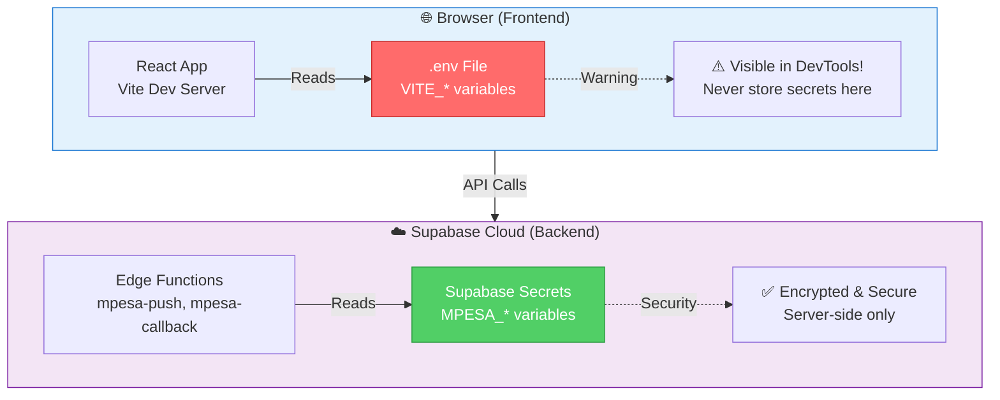

# Environment Variables Guide

## 🏗️ Architecture: Frontend vs Backend



## 📂 Two Separate Storage Locations

### 1. Frontend Environment Variables (`.env` file)

**Location**: `/Users/app/Desktop/jiraniride-app/.env`

**Purpose**: Configuration for React frontend

**Variables**:
```bash
VITE_SUPABASE_URL=https://chesujilpgxhapkeesle.supabase.co
VITE_SUPABASE_ANON_KEY=eyJhbGci...
```

**Security Level**: 🔓 **PUBLIC** - Exposed to browser

**Accessed By**: React app (frontend code)

**Why VITE_ prefix?**: Vite only exposes env vars with this prefix to prevent accidentally exposing secrets

---

### 2. Edge Function Secrets (Supabase Cloud)

**Location**: Supabase's encrypted secrets store (not in your files)

**Purpose**: Credentials for server-side Edge Functions

**Variables**:
```bash
MPESA_CONSUMER_KEY=js441p2OR9Vw8rb...
MPESA_CONSUMER_SECRET=HM1l0n2G4Ih...
MPESA_PASSKEY=bfb279f9aa9b...
MPESA_SHORTCODE=174379
MPESA_ENVIRONMENT=sandbox
MPESA_CALLBACK_URL=https://...
```

**Security Level**: 🔒 **PRIVATE** - Server-side only

**Accessed By**: Edge Functions (backend code)

**Set Via**: `supabase secrets set KEY="value"`

---

## 🔒 Security Comparison

### ❌ Bad Practice: Storing M-Pesa in .env

```bash
# DON'T DO THIS!
VITE_MPESA_CONSUMER_KEY=js441p2OR9Vw8rb...
VITE_MPESA_CONSUMER_SECRET=HM1l0n2G4Ih...
```

**Problems**:
1. ⚠️ **Visible in browser** - Anyone can open DevTools and see them
2. ⚠️ **Embedded in JavaScript** - Keys are in your bundled JS files
3. ⚠️ **Publicly accessible** - Even after building, they're in the dist folder
4. ⚠️ **Security breach** - Attackers can steal credentials and make fraudulent payments

**Example Attack**:
```javascript
// Attacker opens browser console:
console.log(import.meta.env.VITE_MPESA_CONSUMER_KEY);
// "js441p2OR9Vw8rb..." ← Credentials stolen! 
```

---

### ✅ Good Practice: Supabase Edge Function Secrets

```bash
# Stored securely in Supabase
supabase secrets set MPESA_CONSUMER_KEY="js441p2OR9Vw8rb..."
```

**Benefits**:
1. ✅ **Server-side only** - Never sent to browser
2. ✅ **Encrypted storage** - Managed by Supabase
3. ✅ **Secure access** - Only Edge Functions can read them
4. ✅ **No exposure risk** - Impossible to access from frontend

**Flow**:
```
User Browser → Calls Edge Function → Edge Function reads secrets → Makes M-Pesa API call
     ↑                                          ↑
  Can't see secrets                    Secrets stay here (secure)
```

---

## 📋 Complete Variable List

### Frontend Variables (`.env`)

| Variable | Purpose | Security | Example |
|----------|---------|----------|---------|
| `VITE_SUPABASE_URL` | Supabase project URL | Public ✅ | `https://xyz.supabase.co` |
| `VITE_SUPABASE_ANON_KEY` | Public API key | Public ✅ | `eyJhbGci...` |

**Note**: The "anon key" is safe to expose - it's rate-limited and protected by RLS policies.

---

### Backend Secrets (Supabase)

| Variable | Purpose | Security | Example |
|----------|---------|----------|---------|
| `MPESA_CONSUMER_KEY` | Daraja API key | Private 🔒 | `js441p2OR9Vw8rb...` |
| `MPESA_CONSUMER_SECRET` | Daraja API secret | Private 🔒 | `HM1l0n2G4Ih...` |
| `MPESA_PASSKEY` | Lipa Na M-Pesa passkey | Private 🔒 | `bfb279f9aa9b...` |
| `MPESA_SHORTCODE` | Business shortcode | Private 🔒 | `174379` |
| `MPESA_ENVIRONMENT` | sandbox/production | Private 🔒 | `sandbox` |
| `MPESA_CALLBACK_URL` | Callback endpoint | Private 🔒 | `https://...` |
| `SUPABASE_URL` | Auto-set by Supabase | Private 🔒 | `https://xyz.supabase.co` |
| `SUPABASE_SERVICE_ROLE_KEY` | Admin key | Private 🔒 | `eyJhbGci...` |
| `SUPABASE_ANON_KEY` | Auto-set by Supabase | Private 🔒 | `eyJhbGci...` |

---

## 🛠️ How to Manage Secrets

### Setting Frontend Variables

1. **Edit `.env` file**:
   ```bash
   nano .env
   ```

2. **Add variables** (must start with `VITE_`):
   ```bash
   VITE_SUPABASE_URL=https://chesujilpgxhapkeesle.supabase.co
   VITE_SUPABASE_ANON_KEY=your_anon_key
   ```

3. **Restart dev server**:
   ```bash
   npm run dev
   ```

---

### Setting Backend Secrets

#### Option 1: CLI (Individual)
```bash
supabase secrets set MPESA_CONSUMER_KEY="your_key"
supabase secrets set MPESA_CONSUMER_SECRET="your_secret"
```

#### Option 2: Setup Script (All at once)
```bash
./setup-mpesa.sh
```

#### Option 3: Dashboard
1. Go to: https://supabase.com/dashboard/project/chesujilpgxhapkeesle/settings/functions
2. Navigate to "Edge Functions" → "Secrets"
3. Add secrets via UI

---

### Viewing Secrets

#### Frontend (.env)
```bash
cat .env
```

#### Backend (Supabase)
```bash
supabase secrets list
# Shows digests (hashes), not actual values - you can't read them back
```

**Important**: Supabase secrets are write-only for security. Once set, you can't view them, only update.

---

## 🔍 Common Questions

### Q: Can I store M-Pesa keys in a `.env.local` file?
**A**: No! All `.env*` files in Vite projects are exposed to the browser. Only `VITE_*` variables from `.env` are safe, and only for public data.

### Q: Why is the anon key in .env if it's a key?
**A**: The anon key is designed to be public. It's protected by:
- Row Level Security (RLS) policies
- Rate limiting
- It can only access what your RLS policies allow

### Q: What if someone steals my anon key?
**A**: They can only access what your RLS policies permit. The anon key is meant to be public and is safe when RLS is properly configured.

### Q: Can I use .env for local development and Supabase secrets for production?
**A**: No. M-Pesa credentials should ALWAYS be in Supabase secrets, even for development. The `.env` file is always exposed to the browser.

---

## 📚 Best Practices

1. ✅ **Never commit `.env`** to git (it's in `.gitignore`)
2. ✅ **Use `.env.example`** to document required variables
3. ✅ **Prefix frontend vars** with `VITE_`
4. ✅ **Store payment credentials** in Supabase secrets
5. ✅ **Rotate secrets regularly** in production
6. ✅ **Use different credentials** for sandbox vs production

---

## 🔗 Related Files

- [`.env.example`](file:///Users/app/Desktop/jiraniride-app/.env.example) - Template showing required variables
- [`setup-mpesa.sh`](file:///Users/app/Desktop/jiraniride-app/setup-mpesa.sh) - Script to set M-Pesa secrets
- [`MPESA_SETUP.md`](file:///Users/app/Desktop/jiraniride-app/MPESA_SETUP.md) - Complete M-Pesa setup guide
- [`supabase/functions/mpesa-push/index.ts`](file:///Users/app/Desktop/jiraniride-app/supabase/functions/mpesa-push/index.ts) - Edge Function using secrets

---

## 🎯 Quick Reference

```bash
# Frontend (Browser)
.env file → VITE_* variables → React app can read → Exposed to browser ⚠️

# Backend (Server)
Supabase secrets → MPESA_* variables → Edge Functions can read → Secure 🔒
```

**Remember**: If it's sensitive, it goes in Supabase secrets, not `.env`!
